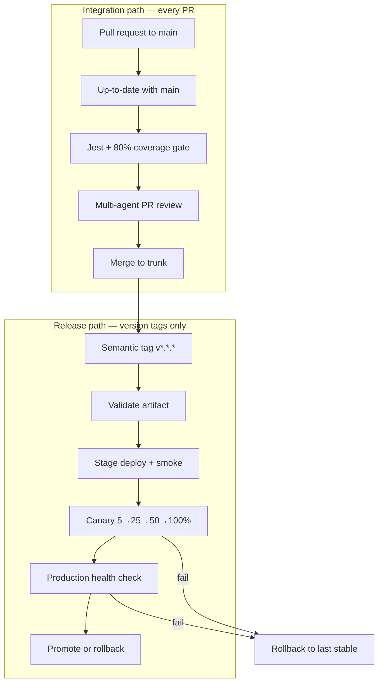
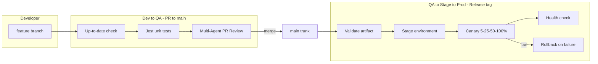

# Continuous Agentic Deployment (CA/CD) Sandbox

[](.github/workflows/dev-to-qa.yml)
[](.github/workflows/stage-to-prod.yml)
[](package.json)
[](agents/requirements.txt)
[](package.json)

**Reference implementation for secure, agent-assisted delivery on GitHub.**

This repository is an engineering-operating-model showcase: it demonstrates how a team can combine **trunk-based development**, **platform guardrails**, and **multi-agent automation** to ship faster without sacrificing safety. Use it as a portfolio piece, an walkthrough, or a starting template when rolling out agentic DevOps in your organization.

---

## Executive summary

| Dimension | What this repo proves |
|-----------|----------------------|
| **Velocity** | Every PR to `main` gets automated test + AI review in minutes |
| **Safety** | Anti-overwrite controls, linear history, and progressive canary release |
| **Resilience** | Automated rollback when canary or health checks fail |
| **Pragmatism** | Full pipeline runs without paid LLM keys via deterministic heuristics |

The sample application is intentionally small (Express API + Jest). The value is in the **delivery system** — workflows, agents, guardrails, and documentation that mirror how a mature engineering org operates.

---

## Engineering operating model

CA/CD separates **integration** from **release**:



### Integration (Dev → QA)

- **Trigger:** Pull request targeting `main`
- **Goal:** Catch regressions and structural risk *before* merge
- **Human role:** Approve PR after reading agent summary + diff
- **Automation role:** Enforce up-to-date branch, run tests, post synthesized review

### Release (QA → Stage → Prod)

- **Trigger:** GitHub Release published (or manual workflow dispatch)
- **Goal:** Progressive exposure with a clear rollback path
- **Human role:** Approve `stage` and `production` environment deployments
- **Automation role:** Re-run tests on tag, simulate canary ramp, invoke rollback on failure

---

## Architecture overview



---

## Repository layout

```
CACD/
├── server.js                 # Express API (deployable artifact under test)
├── tests/server.test.js      # Jest tests with coverage thresholds
├── agents/
│   ├── devops_agent.py       # Architect + Security multi-agent reviewer
│   └── requirements.txt
├── scripts/
│   ├── canary_deploy.py      # Progressive traffic simulation
│   └── rollback.py           # Automated rollback + audit trail
├── .github/workflows/
│   ├── dev-to-qa.yml         # PR pipeline
│   └── stage-to-prod.yml     # Release pipeline
├── docs/
│   ├── GIT_WORKFLOW.md       # Trunk-based development guide
│   └── BRANCH_PROTECTION.md  # GitHub settings checklist
└── .deploy-state/            # Last known-good release metadata
```

---

## Governance and anti-overwrite guardrails

Concurrent developers overwrite each other when process and tooling diverge. This repo encodes the controls that prevent that class of incident:

| Control | Mechanism | Owner |
|---------|-----------|-------|
| Single trunk | All work merges to `main` only | Engineering |
| Short-lived branches | `feature/*`, rebased daily | Developer |
| Up-to-date before merge | Branch protection + CI `git rev-list` check | Platform |
| Linear history | Squash/rebase merges — no merge-commit diamonds | Platform |
| Small PRs | Architect agent flags large blast-radius diffs | Agent + reviewer |
| Concurrent feature detection | Heuristics + LLM for migrations, lockfiles, renames | Agent |

Detailed runbooks: [docs/GIT_WORKFLOW.md](docs/GIT_WORKFLOW.md) · [docs/BRANCH_PROTECTION.md](docs/BRANCH_PROTECTION.md)

---

## Multi-agent PR review

`agents/devops_agent.py` parses the PR diff and runs two specialized agents, then synthesizes a single recommendation:

| Agent | Responsibility |
|-------|----------------|
| **Architect** | Structural integrity, DB/state conflicts, overwrite risk from wide changes |
| **Security/Test** | OWASP-style issues, secrets in diff, missing tests |

Output is posted as **one markdown comment** on the PR with a merge recommendation: `APPROVE`, `REQUEST_CHANGES`, or `BLOCK`.

### LLM providers (free-friendly)

1. Create an [OpenRouter](https://openrouter.ai) account (free credits available).
2. Add repository secret: `OPENROUTER_API_KEY`
3. Optional variable: `OPENROUTER_MODEL` (default: `qwen/qwen-2.5-coder-32b-instruct`)

Without an API key, the pipeline still runs using **deterministic heuristics** — suitable for forks, CI demos, and offline dry runs.

### Agent operating principles

- Agents **inform** human reviewers; branch protection and required checks remain the enforcement layer.
- Heuristic fallback ensures the pipeline never blocks on external API availability.
- Review scope is limited to the PR diff — no repo-wide hallucinated findings.

---

## Quality gates

| Gate | Threshold | Enforced in |
|------|-----------|-------------|
| Unit tests | All passing | `dev-to-qa.yml`, `stage-to-prod.yml` |
| Line coverage | ≥ 80% | `package.json` Jest config |
| Branch coverage | ≥ 70% | `package.json` Jest config |
| Up-to-date with `main` | Zero commits behind | `anti-overwrite-guard` job |
| Release validation | Tests re-run on tag SHA | `validate-release` job |

---

## Adoption roadmap (for real teams)

Use this sandbox as a phased rollout guide:

| Phase | Scope | Actions |
|-------|-------|---------|
| **1 — Foundation** | Trunk + protection | Enable branch protection per [BRANCH_PROTECTION.md](docs/BRANCH_PROTECTION.md); adopt [GIT_WORKFLOW.md](docs/GIT_WORKFLOW.md) |
| **2 — Shift-left** | PR pipeline | Enable `dev-to-qa.yml`; require status checks on `main` |
| **3 — Agent assist** | Optional LLM | Add `OPENROUTER_API_KEY`; tune `OPENROUTER_MODEL` for cost/latency |
| **4 — Progressive delivery** | Environments | Create `stage` and `production` environments; wire approval gates |
| **5 — Resilience** | Rollback drills | Run `stage-to-prod.yml` with `simulate_failure: true` quarterly |

---

## Quick start (local)

### Prerequisites

- Node.js 20+
- Python 3.11+
- Git

### API

```bash
npm install
npm test
npm start
# GET http://localhost:3000/api/health
# GET http://localhost:3000/api/recommendations
```

### Agent (dry run)

```bash
cp .env.example .env
pip install -r agents/requirements.txt
git diff main...HEAD > pr.diff
# Linux/macOS: export PR_DIFF_FILE=/tmp/pr.diff
# Windows (PowerShell): $env:PR_DIFF_FILE = "pr.diff"
export GITHUB_REPOSITORY=your-org/cacd-sandbox
export PR_NUMBER=1
export GITHUB_TOKEN=ghp_xxx
python agents/devops_agent.py --dry-run
```

---

## GitHub setup (replicate for free)

### 1. Create repository

Push this project to a new public repo on your GitHub account.

### 2. Branch protection

Follow [docs/BRANCH_PROTECTION.md](docs/BRANCH_PROTECTION.md):

- Require PR, linear history, up-to-date branches
- Required checks: `Enforce up-to-date with main`, `Jest + Multi-Agent PR Review`

### 3. Environments

**Settings → Environments** — create:

| Environment | Reviewers | Deployment branches |
|-------------|-----------|---------------------|
| `stage` | 0–1 optional | `main` or tags `v*` |
| `production` | 1–2 required | Tags only (`v*.*.*`) |

### 4. Secrets and variables

| Name | Required | Purpose |
|------|----------|---------|
| `GITHUB_TOKEN` | Auto (Actions) | PR comments |
| `OPENROUTER_API_KEY` | Optional | Full LLM agent review |
| `OPENROUTER_MODEL` | Optional (variable) | Override default model |

### 5. Validate Dev → QA

Open a PR to `main`. The workflow will:

1. Fail if your branch is behind `main`
2. Run Jest (with coverage thresholds)
3. Post multi-agent review comment

### 6. Validate Stage → Prod

```bash
git tag v1.0.0
git push origin v1.0.0
# Create GitHub Release from tag → triggers stage-to-prod.yml
```

**Test rollback:** Run workflow manually with `simulate_failure: true`.

---

## Pipelines

### Dev → QA (`.github/workflows/dev-to-qa.yml`)

**Trigger:** Pull requests to `main`

| Job | Action |
|-----|--------|
| Anti-overwrite guard | Ensures `HEAD` is not behind `origin/main` |
| Test + agent review | `npm test` + `devops_agent.py` → PR comment |

Concurrency is scoped per PR (`cancel-in-progress`) to avoid stale check results.

### Stage → Prod (`.github/workflows/stage-to-prod.yml`)

**Trigger:** Release published or manual dispatch

| Stage | Action |
|-------|--------|
| Validate | Checkout tag, `npm test` |
| Stage | Simulated deploy + smoke check |
| Production | Canary 5% → 25% → 50% → 100% |
| Rollback | `scripts/rollback.py` on canary/health failure; audit in `.deploy-state/rollbacks/` |

---

## API reference

| Method | Path | Description |
|--------|------|-------------|
| `GET` | `/api/health` | Service health and uptime |
| `GET` | `/api/recommendations` | List DevOps recommendations (`?category=`, `?priority=`) |
| `GET` | `/api/recommendations/:id` | Single recommendation |

---

## Design principles

1. **Trunk-based development** — one integration branch, fast feedback loops
2. **Shift-left security** — agent review before merge, not after incident
3. **Progressive delivery** — canary with automated rollback
4. **Observable automation** — JSON structured logs in deploy scripts
5. **Graceful degradation** — heuristics when LLM keys are absent
6. **Human-in-the-loop** — automation accelerates review; humans retain merge authority

---

## Contributing

1. Branch from `main`: `feature/your-change`
2. Rebase on `main` before opening PR
3. Ensure `npm test` passes locally (coverage thresholds enforced)
4. Open PR; wait for Dev → QA pipeline and review comment

---

## License

MIT — use freely for portfolios, workshops, and internal templates.

---

Built to demonstrate **Continuous Agentic Deployment** — where human process, platform guardrails, and AI agents share responsibility for safe delivery.
